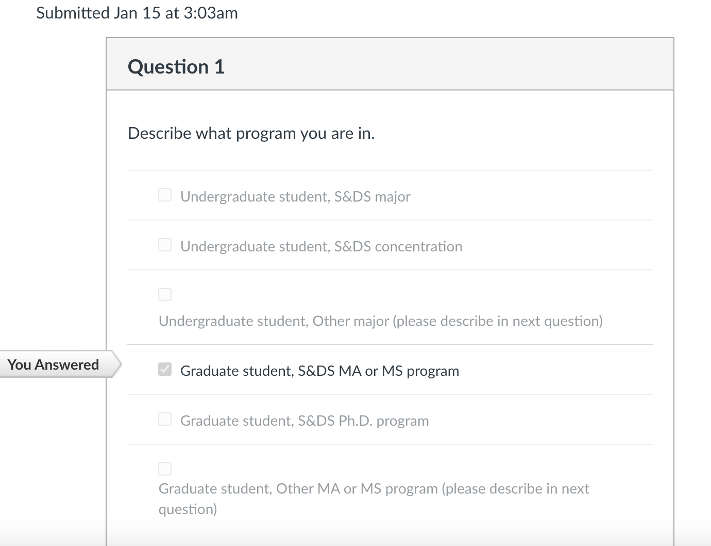

```{r setup, include=FALSE}
knitr::opts_chunk$set(echo    = T, 
                      include = T,
                      warning = F,
                      message = F,
                      comment = NA,
                      fig.height = 5, 
                      fig.width  = 5, 
                      fig.align  = 'center')
library(knitr)
```

## Part 1: Course prep and software installation


#### 1. Complete the Course Survey in the Quizzes section of Canvas  

After you submit the quiz, take a screenshot of the time stamp and Question 1. It should look something like this. 



Edit the above file name and path to show your screenshot and ensure that it appears when you knit your document. 

#### 2. Download and install the latest version of R 

See https://bmacgtpm.github.io/notes/software-installation.html for some potentially useful tips. 

The following code will show your version of R when you knit the document. It should say `R version 4.3.2` or later. Make sure it appears when you knit your document.  

```{r}
R.Version()$version.string
```

#### 3. Download and install the latest version of RStudio. 

See https://bmacgtpm.github.io/notes/software-installation.html for some potentially useful tips.

This code will show your version of R when you knit the document. Make sure it appears when you knit your document.  It should say `2023.12.0+369` (or later).  

```{r}
rstudioapi::versionInfo()$long_version
```

#### 4. Install/update packages

See https://bmacgtpm.github.io/notes/software-installation.html for the packages to install. 

Do not write R code for installing packages in this R Markdown. You don't want packages to install every time you knit this document. 

Check that you can load all of the libraries by running this chunk of code and showing that it executes without error. There may be some messages, and maybe warnings about versions. Those are ok. Make sure the output appears when you knit the document. 

```{r error=T}
library(knitr)
library(plotly)
library(scales)
library(DT)
library(leaflet)
library(gganimate)
library(gifski)
library(png)
library(corrplot)
library(GGally)
library(ggmap)
library(shiny)
library(MASS)
library(lme4)
library(arm)
library(pROC)
library(MLmetrics)
library(viridis)
library(RSelenium)
library(rvest)
library(randomForest)
library(FNN)
library(caret)
library(pls)
library(devtools)
library(splines)
library(RecordLinkage)
library(rsconnect)
library(grid)
library(foreign)
library(maps) ## leave uncommented. For some reason GitHub Actions had a problem when this wasn't explicitly loaded here. 

## load tidyverse last!
library(tidyverse)
library(pubtheme)

```

#### 5. Check `gganimate`

See https://bmacgtpm.github.io/notes/software-installation.html. The code from that page is below, except a custom title has been added. Replace my name with yours, uncomment the animation code, run all of this code.

```{r}
# We'll start with a static plot
g = ggplot(iris, 
            aes(x = Petal.Width, 
                y = Petal.Length)) + 
  geom_point() + 
  ggtitle("Brian Macdonald's animation")
g

a = g + 
  transition_states(Species,
                    transition_length = 2,
                    state_length = 1)

#a  ## check that the animation works

## save the animation
# anim_save(a, 
#           filename = 'img/test animation.gif')

```

There should be a static plot and an animated plot above. 
If the `anim_save` worked properly there should be a new `test.gif`
in the `img` folder that has your name. Take a screen shot of your animated gif when the points are near the upper right and show the screenshot here: 


If all of that works, `gganimate` is good to go!  If that doesn't work, see the tips at https://bmacgtpm.github.io/notes/software-installation.html.

Once you have created the animation, comment out the code that creates the animation (as I have done above). This document won't knit to PDF with the animation code in it. You can only knit to HTML. 

#### 6. Bookmarks

See https://bmacgtpm.github.io/notes/software-installation.html. 


## Part 2: Github

#### 7. Create a GitHub account at <https://github.com/> if you don't have one. Submit your GitHub username in Quizzes -> Course Survey on Canvas.

#### 8. Download GitHub Desktop at <https://desktop.github.com/>. 

Take a screenshot showing Github Desktop (or different software, or the command line) and show it here. 


If you have experience with Git/Github, and prefer to use different software or the command line, that's fine, but we may not be able to help if you have a problem.

#### 9. Clone the repo <https://github.com/bmacGTPM/361-Spring-2024> and create PR as follows.

Clone the repo, create a new branch and name the branch `Firstname Lastname` your first and last name. Make an edit to the R Markdown file `pset00-GitHub-pull-request-Firstname-Lastname.Rmd` to have your name at the top instead of mine. Commit that to your branch, push those commits to GitHub, and create a pull-request to the `main` branch on the 361-Spring-2024 repo. Make the title of the pull request your first and last name. Do not attempt to approve the pull request, just create it. 

For help getting started, see <https://docs.github.com/en/desktop/installing-and-configuring-github-desktop/overview/getting-started-with-github-desktop>.

If you find yourself getting too many GitHub notifications, you can go to https://github.com/watching to choose what notifications you get. [This page](https://docs.github.com/en/account-and-profile/managing-subscriptions-and-notifications-on-github/managing-subscriptions-for-activity-on-github/managing-your-subscriptions) has some more info on notifications/subscriptions. 

#### 10. Set up Github Copilot in RStudio

See https://bmacgtpm.github.io/notes/github-copilot-in-rstudio.html.  


If you use Github Copilot elsewhere, take a screenshot of whatever software you use.

It might take a few days to get final approval.  Once you submit the information they ask for, they will say you will receive final approval shortly.  This may take a couple of days.  For the problem set, submit a screenshot of the page that says you need to wait for final approval, or a screenshot of the farthest you are able to get in the process of getting approval. If you don't receive final approval before the assignment due date, not to worry.  It may take longer than usual to receive final approval since it is the beginning of the semester.  


